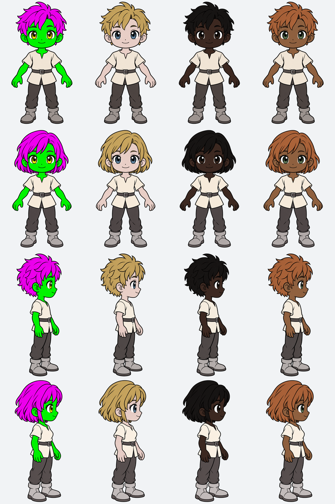

# Human base models — v1

Approved QuestAcademy Human character concepts, created September 30, 2026.
The four PNGs are the original generated files, preserved byte-for-byte with
their RGBA transparency. The earlier discarded male draft is not included.

| Model | Front reference | Combat reference |
| --- | --- | --- |
| Human male (`human-male-v1`, existing gender `A`) | [Front](human-male-front.png) | [Right near-profile](human-male-right-80.png) |
| Human female (`human-female-v1`, existing gender `B`) | [Front](human-female-front.png) | [Right near-profile](human-female-right-80.png) |

Each file is 1024 × 1536. Both models use the same intended chibi proportions,
simple pen-art styling, neutral starter clothing, and configurable colors.
The combat references face screen-right, approximately 80° from front, with
offset limbs. This angle is an art direction target, not a measured 3D camera.
The female combat reference adds the approved modest bust contour beneath the
tunic; the earlier front reference predates that adjustment. Reconcile the
front torso with the combat reference when producing the final layered art.

## Color associations

[manifest.json](manifest.json) associates both model IDs and all four views
with three independent color channels and versioned eight-option palettes.

| Channel | Recolor | Preserve |
| --- | --- | --- |
| Hair | Hair and eyebrows | Ink contours and eyelashes |
| Eyes | Irises only | Pupils, eye whites, highlights, eyelashes and outlines |
| Skin | Face, ears, neck, exposed arms and hands | Hair, eyes, clothing and ink |

The supplied hex values are initial natural-tone palette options in sRGB.
They are not exact pixel-replacement keys for the colored illustrations.
The images have shading and antialiasing; do not recolor them by matching
brown pixels, applying a whole-image hue filter, or desaturating the entire PNG.
Hair, eyes, and skin can share similar colors but must remain independent.

Keep these colored masters. Each view now has three aligned grayscale masks
(hair, irises, skin) and a neutral shading base in [recolor/](recolor/README.md).
The derivatives preserve every original alpha byte and all untargeted RGB
pixels. The manifest records their paths and hashes. Diagnostic colors and
light, dark, and mixed natural palettes have been checked across all four views.

Run `npm run preview:avatars` for the local color workshop, or
`npm run build:avatar-assets` to rebuild masks, neutral bases, and individual
preview images from the checked-in region maps.

The views are **recolor-ready, but not rigged**. Segmented parts and rigs remain absent.
The separately generated views are not guaranteed to have pixel-aligned joints.
When preparing animation parts, redraw hidden overlap beneath joints, align the
shared rig, and keep far/near limbs and weapon/shield attachment points separate.

## Creation and persistence contract

At initial character creation, independently select one of eight hair colors,
one of eight eye colors, and one of eight skin colors, uniformly. That gives
512 combinations per model. The player can override each choice. The sample
colors in the illustrations are never universal defaults.

Persist the confirmed `modelId`, the three palette IDs, and `hairColorId`,
`eyeColorId`, and `skinColorId` for the student's character. Palette records hold
their versions. Validate option IDs against that model's palette bindings.
Reuse the saved selections across front/combat views,
refreshes, logins, and job changes; do not reroll when an avatar renders. Existing
characters need an explicit appearance setup/backfill policy, not incidental
random changes during rendering.

The manifest is the source-controlled asset catalog. Migration
`0006_avatar_foundation.sql` creates dedicated avatar tables and seeds these
models, views, palettes, and 18 equipment slots per model. It changes no existing
student data. Migration `0007_human_recolor_masks.sql` associates the twelve
masks and four neutral bases with the matching source hashes and marks those
views recolor-ready. Database helpers implement one-time randomized creation, reads
without rerolling, and explicit color changes. See
[the avatar database specification](../../../../docs/avatar-database.md).

The old fixed class portraits are superseded as the product direction. The
current `PlayerAvatar.tsx` still displays them until a new renderer and creator
are wired to the avatar tables. Database helpers are not yet exposed through
HTTP routes. This foundation does not claim that recoloring or animation is
live, and committing a migration does not apply it to the hosted database.

Equipment has dedicated head, neck, torso, pelvis, left/right upper-arm,
forearm, hand/glove, thigh, shin, and foot/boot slots. Left/right hand grips are
separate, so a glove can coexist with a weapon or shield. These are anatomical
sides, not near/far rendering layers. Per-view attachment transforms remain
null until calibrated against the final segmented art. Empty equipment slots
have no equipped-item row; no placeholder equipment is granted.

Paths in the manifest are relative to this directory. They are source-asset
paths, not deployed URLs: the current Vite build only bundles assets imported
by client code (for example through the existing `@assets` alias).
