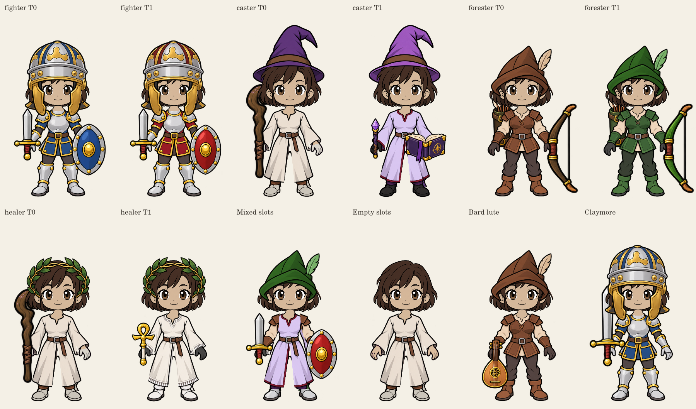

# Equipped gear visuals and Tier 1 artwork

Status: implemented for review on `feat/equipped-gear-art`, stacked after gear
comparisons (PR #45). Not deployed. Owner direction: October 7, 2026 MDT.

The avatar now reads its eight equipped item IDs. Chest, paired Arms, paired
Hands, Pants, Feet, Head, Weapon and Off hand select independently. Equipping,
unequipping, remembered job changes and saved appearance edits use the current
loadout in the lobby. Character creation and other-job previews use starters;
the current-job preview uses actual gear. Combat freezes those IDs alongside
stats/effects on entry, preserves them through serialization/rejoin, and does
not change appearance when lobby gear changes mid-fight. Legacy rooms without
IDs use deterministic starter visuals.

## Completed for review

- Both Human bodies use the approved front-facing identity, palettes, neck fits
  and headwear occlusion, with independently selected static clothing layers.
- Tier 1 fighter/forester/healer/caster outfits reuse Tier 0 silhouettes and
  follow the requested red, green, white and violet/burgundy palettes.
- Healer's Laurel replaces the catalog name Healer's Hood. Its ID and bonus stay
  unchanged. The withdrawn head-stat proposal is **not** implemented: healer,
  caster and forester heads remain +1 DEF; fighter helm remains +1 DEF/+1 STR.
  Six-piece armor budgets therefore stay 3 DEF/3 primary, or fighter
  3 DEF/3 STR/3 VIT. No stats or acquisition rules change in this branch.
- All Tier 0 and new Tier 1 weapon/off-hand families have static representations,
  including a distinct starter harp and Tier 1 lute, ankh, book and claymore.
- Empty head/held slots hide their items. Empty armor slots use neutral modest
  clothing. Unknown custom items use neutral/no-prop fallback and a title
  explaining that custom artwork is unavailable; gameplay stats are unchanged.
- Known slot changes are part of the render cache key. Stale asynchronous draws
  cannot replace a newer selection. Quivers remain behind the right shoulder.

The [asset package](../attached_assets/characters/human/equipment-static-v1/README.md)
records source provenance, runtime masks/grips, hashes and review generation.
The original approved artwork is unchanged. Item art does not grant ownership,
alter permissions, level gates, stats, abilities or loot eligibility.

## Validation and pending work

Tests cover unchanged head budgets, explicit empty slots, unknown IDs, frozen
combat IDs, duplicate admission, serialization/rejoin, and actual canvas output
for both bodies. Changing gloves preserves face/hair/skin/chest; changing a hat
preserves the body and held items. The review script exercises full Tier 0/Tier 1
sets, cross-material mixed equipment, empty gear and advanced weapons.

Pending: owner visual review, PR review, deployment and live acceptance. Full
animation, near-profile views, skeleton-connected parts, moving grip/occlusion
validation and custom-item artwork remain separate work. These static masks and
props are not an approved animation rig or animation-ready database record.
No migration is added here; stacked migrations 0012 and 0013 remain prerequisites
for releasing the earlier remembered-loadout/Tier 1 changes.

## Fitted review exports

Validation: all 133 tests, TypeScript checking, production client/Worker build,
review rendering, standalone workshop build and `git diff --check` pass locally.
Hosted CI/browser acceptance run on the review PR.
